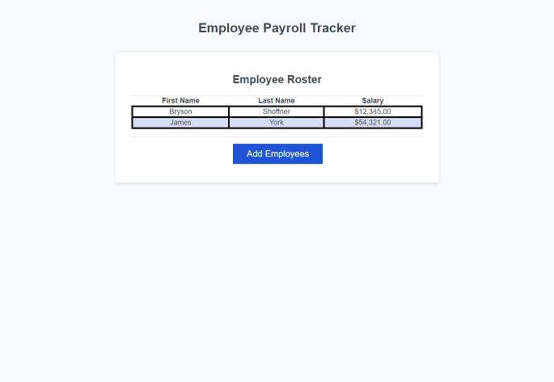

# Employee Payroll Tracker Challenge
## What was the purpose of this challange?

The purpose of this challange was to add functionality to the website.

This was done by:

- Adding employee data into the prompts
- The data is then displayed in alphabetical order by last name
- The salary input is displayed as USD.  If any input other than a number is entered it defualts to $0
- In the console log the average employee salary and a random employee are displayed

 ## Links
 [Live URL](https://bryson987081.github.io/employee-payroll-tracker-challenge/)

 [GitHub Repo](https://github.com/Bryson987081/employee-payroll-tracker-challenge)